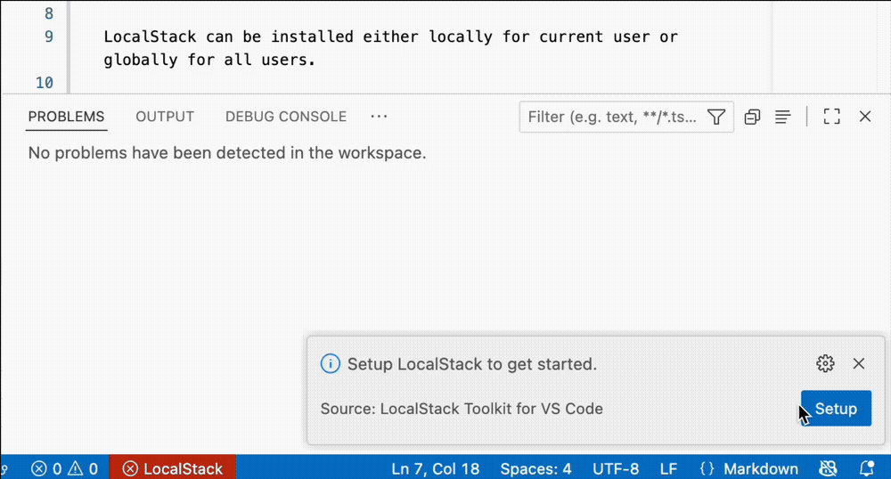

# LocalStack Toolkit for VS Code

The LocalStack Toolkit for VS Code enables you to install, configure, and run LocalStack without leaving VS Code.

## Install and configure LocalStack

The setup wizard ensures LocalStack is installed and configured for a seamless integration with AWS tools, like the AWS Toolkit VS Code extension, AWS CLI, SDKs, and CDK.

LocalStack can be installed either locally for the current user or globally for all users.

You can start using LocalStack for free by signing up for a free account or signing into an existing one. The setup wizard facilitates this process and configures your authentication token required to start LocalStack.

The LocalStack Toolkit integrates seamlessly with AWS tools like the AWS Toolkit VS Code extension, AWS CLI, SDKs, and CDK. It automatically configures a dedicated `localstack` AWS profile in your `.aws/config` and `.aws/credentials` files, if one is not already present.



## Run LocalStack

The LocalStack button in the VS Code status bar provides an instant view of LocalStack's runtime status, such as `stopped` or `running`.

The status bar button provides access to `Start` and `Stop` LocalStack commands. The status button turns red if LocalStack is not found or misconfigured.

## Viewing LocalStack logs

You can see LocalStack logs in the VS Code Output panel. Simply select LocalStack from the drop-down menu.

## `localstack` AWS profile

Once the profile is configured you can use it from your favorite AWS tools like the AWS Toolkit VS Code extension, AWS CLI, SDKs, and CDK to deploy to and interact with LocalStack.
For example, the AWS Toolkit for VS Code includes compatibility with your `localstack` AWS profile and the integration enables Lambda Remote Debugging on LocalStack. Check [AWS Lambda with LocalStack support](https://docs.aws.amazon.com/toolkit-for-vscode/latest/userguide/lambda-localstack.html) and [LocalStack Lambda Remote Debugging](https://docs.localstack.cloud/aws/tooling/lambda-tools/remote-debugging/) for detailed information.

## Changelog

[Read our full changelog](./CHANGELOG.md) to learn about the latest changes in each release.


# Contributing

## Installation

```sh
npm install
```

## Configuration

The repository comes with an `.env.local` file configured to work locally.

Feel free to check it out, and make a copy to `.env` in order to customize.

```sh
cp .env.local .env
```

## Generating the VSIX File

A VSIX file is a packaged extension for Visual Studio Code. It contains all the files and metadata needed to install and run the extension.

The VSIX file is need to install the extension manually or distribute it to others.

To update the extension after making code changes, you need to regenerate the VSIX file.
Run the following command in your project directory:

```sh
make vsix
```

This will build a new `.vsix` file in the directory (localstack-x.x.1.vsix).

While installing from a VSIX file is common for local development or sharing, you can also run and test the extension directly in VSCode without packaging it.
To do this, open the extension project in VSCode and press `F5` to launch a new Extension Development Host window.

## Installing the VSIX File

To install the generated VSIX file in Visual Studio Code:

1. Open the Extensions view (`Cmd+Shift+X` on macOS, `Ctrl+Shift+X` on Windows/Linux) in VSCode.
2. Click the three-dot menu in the top right.
3. Select **Install from VSIX...**.
4. Choose the `.vsix` file.
